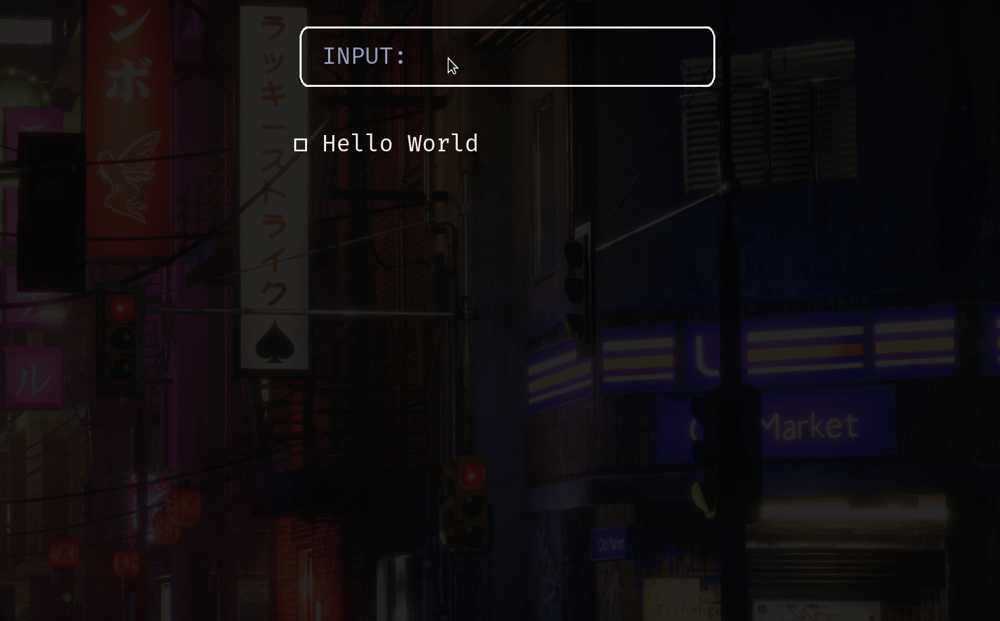

# todo-cli

bloated todo-cli. created for the purposes of reimplementing useQuery and useMutation from [TanStack Query](https://tanstack.com/query/v4) but in node.



## Setup

```sh
# install deps
yarn install
# sync db
yarn run prisma db push

# dev
yarn dev
# build
yarn build
# start
yarn start
```

## Usage

```
INSERT MODE:
  esc: enter NORMAL
  enter: add todo

NORMAL MODE:
  a = enter INSERT
  j = move down
  k = move up
  R = refetch todos
  x = delete at cursor
  enter = toggle at cursor
```

---

Made with ☕ by Prince Carlo Juguilon
